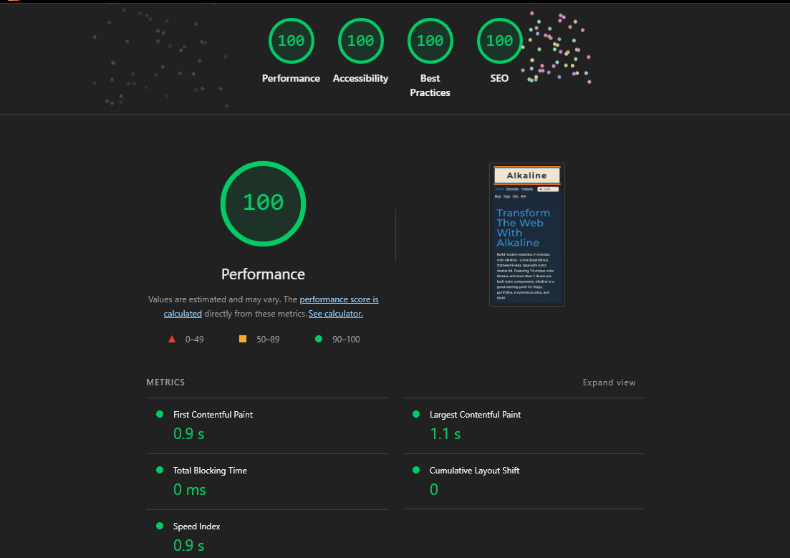
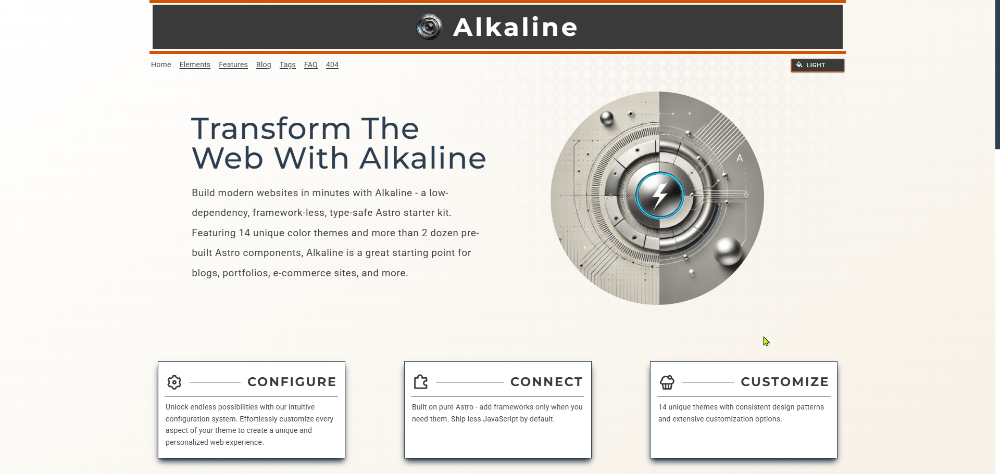
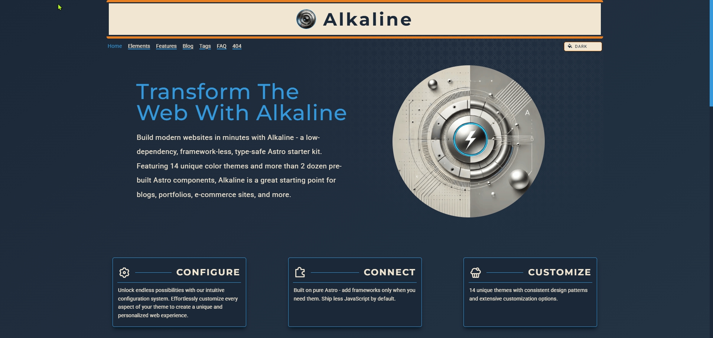
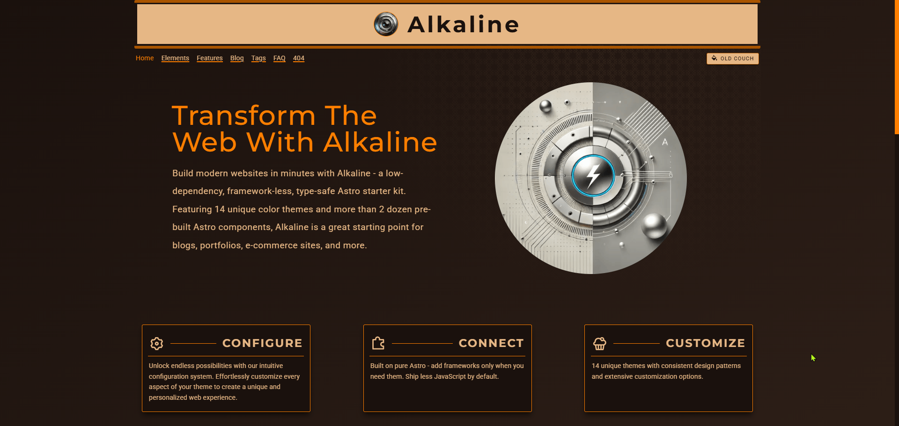
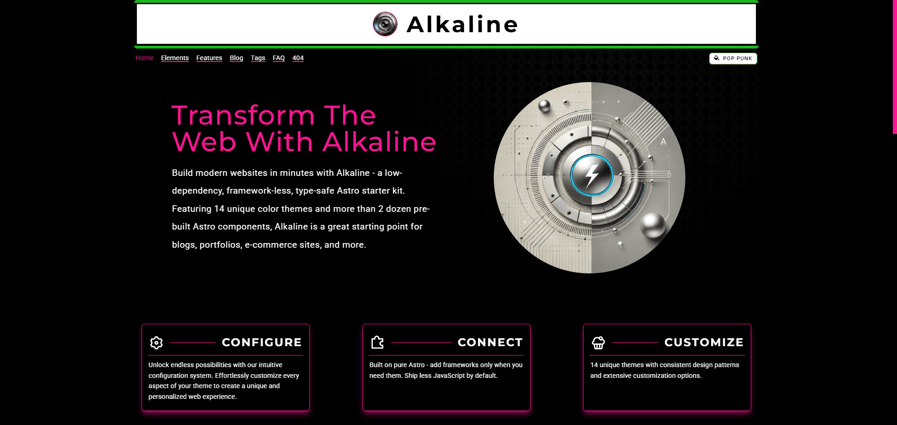

# Alkaline


👉 **[Live Demo](https://alkaline-site.vercel.app/)**

💻 **[New to Astro](https://docs.astro.build/en/getting-started/)**

**Alkaline** is a sleek, Astro-powered theme designed for speed, clarity, and low-JavaScript sites.
It ships with **14 built-in color themes**, **multiple layouts**, **24 pre-built components**, and **SEO optimizations**—all while keeping dependencies minimal.

## 🚀 Features

- ⚡ **Near Zero-JS** by default for blazing fast performance
- 🎨 **14 color themes** with light/dark support and a dead simple way to add your own
- 📝 **Blog & Docs layouts** baked in
- 🔎 **SEO ready** OpenGraph + meta tags included
- 📖 **Documentation** provided in each and every component
- 🛠️ **TailwindCSS** for easy styling and customization
- 🤯 **24 components** to help you get started

### 📊 Performance & Accessibility

Alkaline is built with a performance-first, semantic HTML approach.
It consistently scores **100** in Lighthouse audits right out of the box.



## 🖌️ Sample Themes

<p align="center">
  
  
</p>

<p align="center">
  
  
</p>

## 📦 Getting Started

Clone and run locally:

```bash
git clone https://github.com/AMagicianNamedGob/alkaline
cd alkaline
pnpm install // or npm install
pnpm dev // or npm run dev
```

Open `http://localhost:4321` in your browser.

## 🛠️ Configurations

- **alkaline.config.ts** – Main theme configuration. Customize site metadata, authors, fonts, and other global settings. Feeds data across the site and can be tailored to your needs.

- **google-fonts.ts** – Preloaded with 250 Google Fonts. Add more by simply including the font name in the type.

- **Types/types.ts** – TypeScript definitions for Alkaline. Ensures type safety and consistency across the project. Works with `alkaline.config.ts` for a smooth configuration experience.

### Preconfigured files (usually no changes needed unless customizing)

- `astro.config.mjs`
- `content.config.ts` *(advanced options available)*
- `eslint.config.js`
- `tailwind.config.js`
- `tsconfig.json`

## 👻 Dependencies Docs

While Alkaline is designed to be lightweight with minimal dependencies, it does rely on a few key packages to deliver its features and performance. Here are the main dependencies used in Alkaline, as well as links to their documentation for further reference:

- Astro - <https://astro.build/docs>
- TailwindCSS - <https://tailwindcss.com/docs>
- Astro-Icon - <https://:github.com/natemoo-re/astro-icon>
- MDX - <https://mdxjs.com/docs/getting-started>

## 🔮 Roadmap

Alkaline is stable as-is, but the **future focus is a Next.js rebuild**.
That means this repo is a foundation and reference point, not a long-term home for contributions.

Planned steps:

- [x] Live demo site
- [x] Accessibility refinements
- [ ] Potential upgrade to TailwindCSS v4
- [ ] Next.js rebuild (Alkaline v2)

## 🤝 Contributing

Right now, **pull requests aren’t being accepted**, since the Next.js rebuild will change the project’s direction, but that may change based on interest and demand.

That said, **discussions and feedback are welcome**—feel free to open an [issue](../../issues) if you have ideas, requests, or spot a bug.

## 📜 License

MIT © [AMagicianNamedGob](https://github.com/AMagicianNamedGob)

---

<br />

🙏 Alkaline is completely free and open source. I’m currently between jobs, and donations help me cover food and rent while I continue improving and maintaining this theme.

If you’d like to support my work, you can do so here:

- ~~GitHub Sponsors~~ COMING SOON!
- [Buy Me a Coffee](https://buymeacoffee.com/trujared)
- [PayPal](https://www.paypal.biz/jaredMakes)

Your support makes a huge difference — thank you for helping me keep Alkaline alive and free for everyone!
